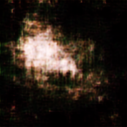

# FG-Mirai (此版本为哈哈笑的科幻群特别构建)
## 移植说明
- **此版本可在Mriai+[cqhttp-mirai](https://github.com/yyuueexxiinngg/cqhttp-mirai)支持下运行**
- 与酷Q不同，Mriai是在底层代码中实现了Android QQ 8.2.7客户端，不需要连接第三方服务器，能活得更久些，除非tx终止Android QQ登陆，就像塞班一样。同时支持当时酷Q pro的发图等高级功能
- 本次移植的改动就是由链接发图修改为CQ码发图
## 与普通版的区别
> * 增加了欢迎新成员功能
> * 增加了找书功能
> * 增加了每日有声书更新提醒功能
> * 接入微软小冰(有触发次数限制，默认每天100次)，基于[这个项目](https://github.com/BennyThink/realXiaoice)
> * 在每日总结中加入了《三体》好句和推荐科幻小说
> * 利用DCGAN神经网络模型生成宇宙星云图片。[星云数据集](assets/dataset.zip)、[模型](assets/DCGAN.py)、[图片生成代码](assets/LoadModel.py)
> * 三体好句源自[这个项目](https://github.com/AyagawaSeirin/ThreebodySpace)
> * 科幻小说数据库来自[这个项目](https://github.com/faa2001/SFDB)

## 技术

关于DCGAN人工神经网络：

DCGAN全名*Unsupervised Representation Learning with Deep Convolutional Generative Adversarial Networks*，中文名是深度卷积生成对抗网络，它属于GAN网络的一个分支。

基本思想是这样的：在DCGAN中，有判别器和生成器两个角色。生成器用于生成图像，这个项目中，图像是由标准正态分布为噪声成的；判别器用于对生成器所生成的图像进行判定，看它属于真实图像的概率是多少。根据网络的损失函数(*loss function*)对生成器的参数进行更新，提升它的“造假”能力。当判别器判别的概率稳定在0.5左右时，即判别器无法分辨生成器生成的图像是真是假时，训练效果较好。

DCGAN网络模型如下，可以说是一个比较成熟的框架了：


更多关于DCGAN的细节，可以参考[DCGAN TUTORIAL](https://pytorch.org/tutorials/beginner/dcgan_faces_tutorial.html)

我使用的是Apple机器学习工程师[*Erik Linder-Norén*](https://github.com/eriklindernoren)的[开源代码](https://github.com/eriklindernoren/PyTorch-GAN/blob/master/implementations/dcgan/dcgan.py)

模型构建的框架为[pytorch](https://pytorch.org/)

## Note
数据集说明：
> * 星云数据集包含249张由哈勃望远镜拍摄的星云图片，可能有重复项目，分辨率为256*256
> * 图片来自[*spacetelescope*](https://www.spacetelescope.org/)

DCGAN模型构建中遇到的问题：
> 构建过程中存在一个问题：训练出来的模型很糊，不知道是什么原因，不知道是否因为训练数据太少造成。如有知道的，或训练成功的朋友可以联系563044462@qq.com～
> DCGAN生成的图片：
> 
> 

关于`hhx_books.json`：
> 结构
> ```
> //每个作者一个JSON对象，最终构成一个数组
> [
>   {
>       "author":"xxx",//作者
>       //该author的作品集数组，一部作品一个JSON对象
>       "works":[
>           {
>               "bookName":"xxx",//书名
>               "platform":["xxx",...],//收听平台
>               "dPath": ["xxx",...]//下载地址
>           },
>           ...
>       ]
>   },
>   ...
> ]
> ```

## Credits
- 机器人-丹尼尔·奥利瓦
- [来福](https://weibo.com/u/1650618111)
- 球状闪电追踪者
