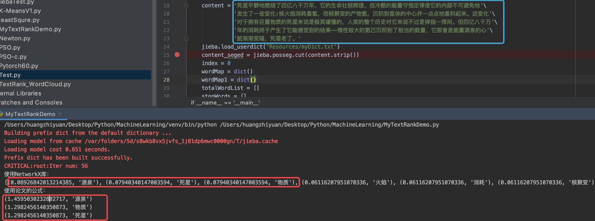
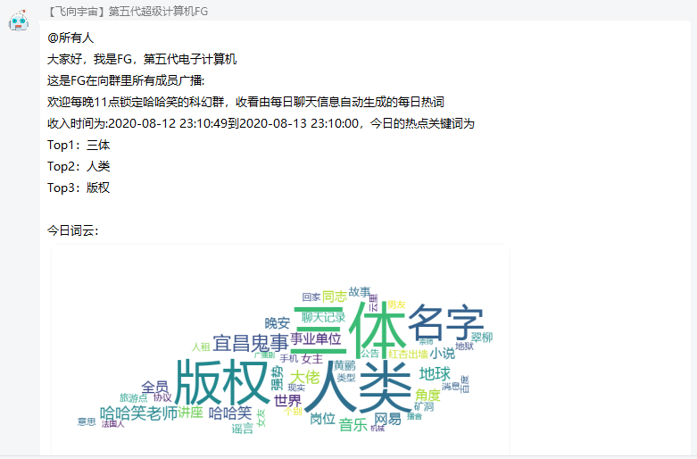

# FG-Mirai


## 关于支持Nonebot2

有小伙伴在issue中提到了这个问题，我觉得是可以支持的，目前这个项目基本由我一人维护，如果有小伙伴愿意帮助迁移Nonebot2，可以提issue或者可以发邮件至hzy@acmsmu.cn，我很欢迎～

## 移植说明
- **此版本可在Mirai+[cqhttp-mirai](https://github.com/yyuueexxiinngg/cqhttp-mirai)支持下运行**
- 与酷Q不同，Mirai是在底层代码中实现了Android QQ 8.2.7客户端，不需要连接第三方服务器，能活得更久些，除非tx终止Android QQ登陆，就像塞班一样。同时支持当时酷Q pro的发图等高级功能
- 本次移植的改动就是由链接发图修改为CQ码发图

## Summary

一个基于Nonebot的QQ群每日总结生成插件，可以根据每日的聊天信息生成每日热词，并以词云方式可视化展示

## Technology

这是一个简单的文本挖掘实验，首先会获取群内聊天记录进行数据预处理，包括Q号什么的进行数据脱敏。

FG的核心是一个称为[**TextRank**](assets/TextRank-algorithm.pdf)的算法，它源自于Google的PageRank，基本思想采用类似投票机制来找出一篇文章的关键词，这里为了稳定性，所以是调库，最后会返回关键词+权重，权重是已经按降序排列过的，所以可以直接用来生成词云。

如果想要更深入了解TextRank算法，可以阅读这篇论文[《TextRank: Bringing Order into Texts》](https://digital.library.unt.edu/ark:/67531/metadc30962/m2/1/high_res_d/Mihalcea-2004-TextRank-Bringing_Order_into_Texts.pdf)。同时，我自己也对论文的关键词提取做了实现[MyTextRankDemo.py](assets/MyTextRankDemo.py)。步骤上基本还原了论文的步骤。对于词组的匹配，由于我是使用结巴分词，可以用户自定义，所以这一步并没有按照论文实现。

自写代码运行效果如下所示：



## Dependency

> * Python >= 3.7
> * nonebot >= 1.5.0 (需安装定时器插件，具体可见官方文档)
> * wordcloud >= 1.6.0
> * [textrank4zh](https://github.com/letiantian/TextRank4ZH)(内置)
> * [CQHTTP Mirai](https://github.com/yyuueexxiinngg/cqhttp-mirai/releases) >= 0.1.9
> * [Mirai OK](http://rbot.d522.com/file/MiraiOK20200807.zip)

## Install

进入项目根目录，然后运行
```
pip install -r requirements.txt
```

## Configuration

**如果文件夹不存在，需自行创建**

配置文件位置
> * cn/acmsmu/FG/data/config.json

词云输出位置
> * cn/acmsmu/FG/data/asssets/wc

词云原图与Mask位置
> * cn/acmsmu/FG/data/asssets/images

自定义词典位置
> * cn/acmsmu/FG/data/myDict.txt

自定义停顿词位置
> * cn/acmsmu/FG/data/stopwords.txt

### config.json

下面是一个配置样例

```
{
    "windowSize":5,//设置TextRank算法的窗口大小，默认为5
    "keyWordLen":3,//小于此长度的词将不会被显示，默认为3
    "keyWordNum":50,//热词数量，默认50
    "fontPath":"C:/Windows/Fonts/msyh.ttc",//字体，用于生成词云
    "nonebotHost":"127.0.0.1",//Nonebot监听地址，具体可参考官方文档的“开始使用小节”
    "nonebotPort":8080,//Nonebot监听端口
    "cqhttpHost":"127.0.0.1",//CQHttp运行端口
    "cqhttpPort":5700,//CQHttp监听端口
    "groupInfo":[//群信息数组
        {
            "timer":"timer1",//定时器名称
            "beginHour":23,
            "beginMinutes":0,//beginHour和beginMinutes的意思是，FG将会在每日的23:00分播报每日总结
            "groupId":"123456"//群号
        }
    ],
    "wcImg":[//用于生成词云的图片数组
        {
            "desc":"刘慈欣",//图片描述
            "fileNameO":"lcx.jpg",//原始图片，用于展示，存放位置cn/acmsmu/FG/data/assets/images文件夹下
            "fileNameU":"lcx.png"//使用图片，即真正用来生成词云的图片，要求除了主体之外，背景为白色，存放位置cn/acmsmu/FG/data/assets/images文件夹下
        }
    ],
    "template":[{//总结模板数组，一个群要定义两个，一个正常模式，另外一个用于没有热词生成时使用，模板里出现的time，content等非数字标签请不要修改，但是位置可以随意，并没有要求要全部出现，出现其中的某些也是可以的
        "groupId":"123456",//群号
        "content":[
        {
            "0":"@所有人",
            "1":"大家好，我是FG，第五代电子计算机",
            "2":"这是FG在向群里所有成员广播:",
            "3":"欢迎每晚XX点锁定XXX群，收看由每日聊天信息自动生成的每日热词",
            "time":"收入时间为:{string}到{string}，今日的热点关键词为",//time标签中一定要有两个{string}，出现位置随意
            "content":"{string}",//用于显示热点关键词，建议不做改动，但是出现位置随意
            "wcImg":"今日词云：{img}",//一定要有{img}
            "wcImgDesc":"今日背景图为 {string}",//一定要有{string}
            "oriImg":"原图：{img}",//一定要有{img}
            "9":"热词生成的宗旨是为您节约时间，让您无需时时在线就能了解动态",
            "10":"如果您对此感兴趣，欢迎每晚XX点进入XXX群~再见！"
        },
        {
            "0":"@所有人",
            "1":"大家好，我是FG，第五代电子计算机",
            "2":"这是FG在向群里所有成员广播:",
            "3":"欢迎每晚XX点锁定XXX群，收看由每日聊天信息自动生成的每日热词",
            "4":"今日群里不够热闹，因此今日无热词",
            "5":"热词生成的宗旨是为您节约时间，让您无需时时在线就能了解动态",
            "6":"如果您对此感兴趣，欢迎每晚XX点进入XXX群~再见！"
        }]
    }]
}
```

### 自定义词典配置

用户可以设置自定义词典，来避免一些专有词被分词工具分割的情况。

例如：`三体人`是一整个词，如果不使用自定义词典，那么可能被分词工具分割成`三体`和`人`两个词，这是不合适的。

自定义词典的格式如下：

```
终产者 n // 空格前为词名，空格后为词性，由于关键词一般是名词，所以使用n(noun)
```

### 自定义停顿词配置

有时候我们聊天的时候会出现：的、吗、不然等之类的词，这些都属于没有意义的词，我们把它归结为停顿词，在仓库中已经内置了一部分停顿词，这类词不会参与到图结构的构建中，因此不会出现在最终的结果中。如果有需要可以在
`stopwords.txt`中修改。

## Run
配置完成后，在根目录下运行
```python
python bot.py
```

## ScreenShots
每日总结



词云


## TODO
- [x] 支持自定义字典

- [ ] 将定制分支中的微软小冰聊天功能加入

## Support
这个项目的开发环境由JetBrains提供，感谢对本项目的支持！

[](https://www.jetbrains.com/)

## Credits

- 机器人-丹尼尔·奥利瓦
- [来福](https://weibo.com/u/1650618111)
- [-禾呈-](https://www.hecheng.moe/)


## Note
FG也即Fifth Generation，第五代超级计算机，灵感来自于刘慈欣长篇科幻，《超新星纪元》
